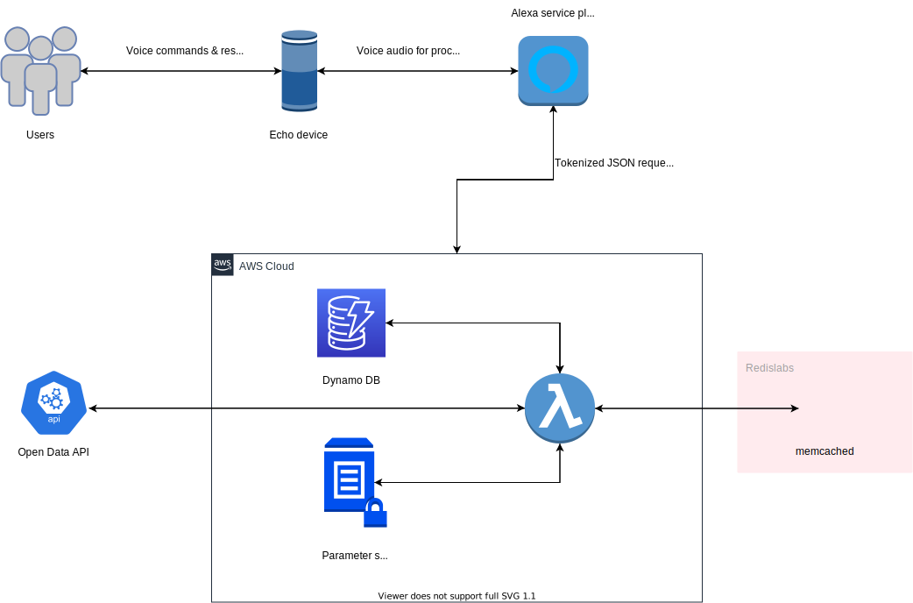

# STIB network Alexa skill

Unofficial Alexa skill for retrieving live data from the STIB-MIVB network.

------------------------------------------------------------------------
## Overview

The brussels public transports company, also known as the STIB-MIVB, has created a 
[platform](https://opendata.stib-mivb.be/store/) to make some of its data including timetables, stop names, locations 
of the stops, line routes and real-time network information publicly available.

This Alexa skill uses the platform to allow users to ask real-time information regarding their usual trips on the
 STIB-MIVB network. The skill currently allows users to configure their favorite trip (favorite STIB-MIVB line and stop name) 
 and ask for buses/metro/trams arrival times based on their trip preferences. Additional features will be added in the future. 

## Usage

The skill can be invoked using the Skill invocation name: **STIB schedule**.

| Example                                       | Description                      |
|------------------------------------------ |--------------------------------------|
| Alexa, launch/open/start STIB schedule     | Launch the skill                   |
| Alexa, launch/open/start STIB schedule  and modify/save/configure my preferences |  Configure your favorite trip by saving your favorite line and stop | 
| Alexa, launch/open/start STIB schedule and tell me when is the next tram/bus/metro | Get next arrival times for you favorite trip  |

## Technologies

This skill is built with:
- [Python 3](https://www.python.org)
- [Alexa Skills kit SDK for python](https://github.com/alexa/alexa-skills-kit-sdk-for-python)
- [Amazon Lambda](https://aws.amazon.com/lambda/) 
- [Amazon DynamoDB](https://aws.amazon.com/dynamodb/) for storing users trip preferences
- [HermesCache](https://pypi.org/project/HermesCache/) using [Amazon ElastiCache for Memcached](https://aws.amazon.com/elasticache/memcached/) as a backend for caching
- [Open Data API](https://opendata.stib-mivb.be/store/)

## Architecture

## Disclaimer
Ce produit/service/application se base sur des données fournies à l’origine par la STIB qui ont été mises à jour le 10 Mai 2020 et qui en totalité ou partiellement ont été modifiées par Antonin Jousson. 

This product/service/application is based on data originally provided by STIB/MIVB that was updated on the 05/10/2020 and that fully or partly was modified by Antonin Jousson.

## License
[Apache v2.0](http://www.apache.org/licenses/LICENSE-2.0)